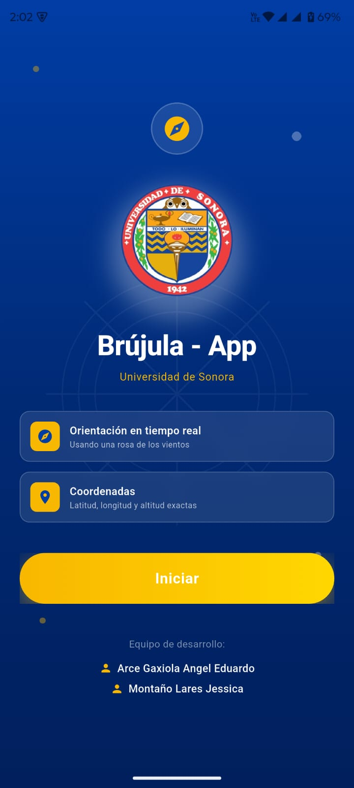
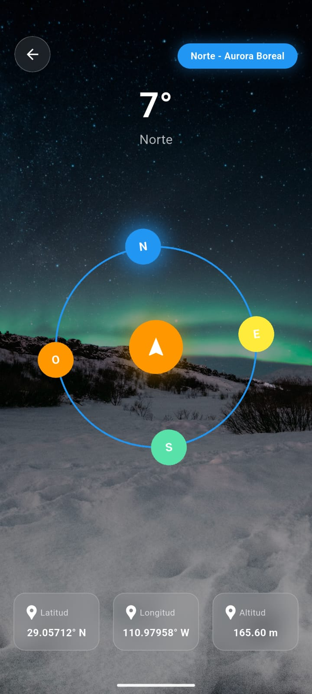
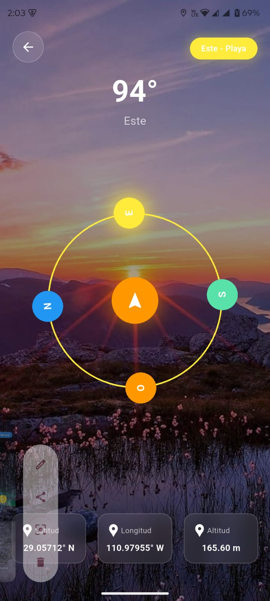
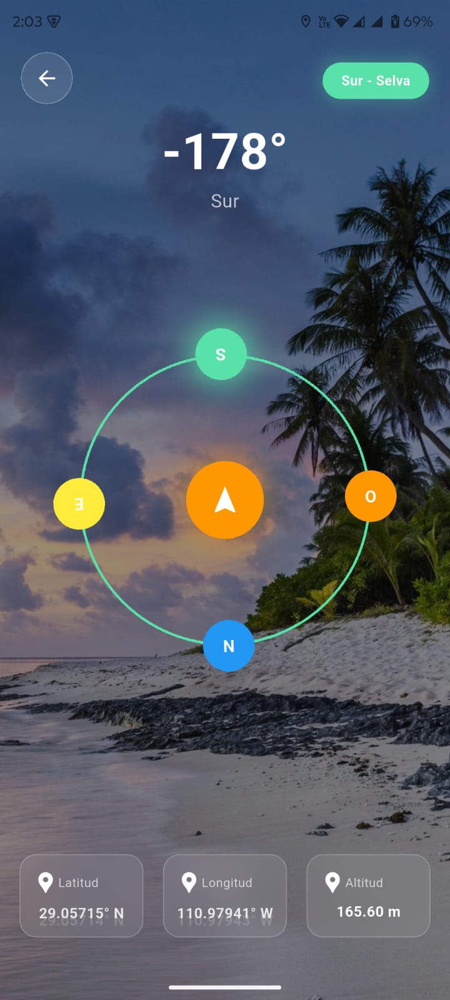
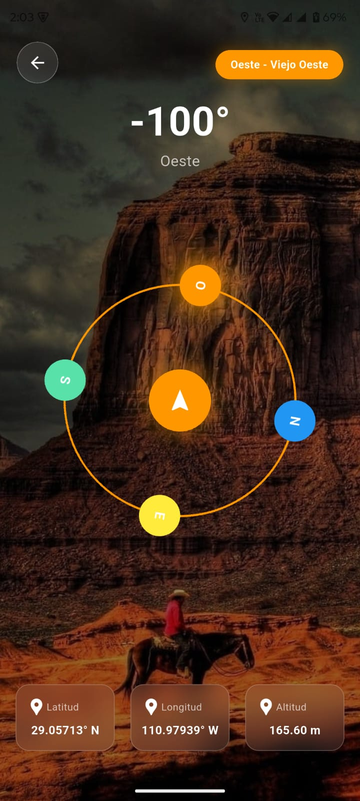

# compass_mobile_pds

Aplicación desarrollada en Flutter que implementa una brujula digital interactiva con detección de orientación en tiempo real y visualización de datos geográficos.

Desarrollada para la materia de Practicas de Desarrollo de Sistemas III (Programacion Movil)

#Caracteriticas

- Detección de orientación en tiempo real (0° - 360°)
- Visualización de latitud, longitud y altitud
- Cambio dinámico de fondo según la región cardinal
- Iluminación del punto cardinal activo
  
Tecnologias: 
- Flutter Flutter 3.41.0 • channel stable • https://github.com/flutter/flutter.git
- Dart 3.11.0
- DevTools 2.54.1

Paquetes utilizados:
- flutter_compass
- geolocator
- permission_handler

Nuestra presentacion:

https://www.canva.com/design/DAHCZYmUaO4/xRGHy3a1YRrynD0duPY21w/edit?utm_content=DAHCZYmUaO4&utm_campaign=designshare&utm_medium=link2&utm_source=sharebutton

Imagenes:

 

  
  
  
  
   

